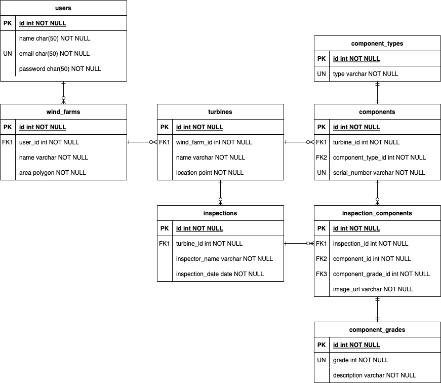

## About Software Development @ Cyberhawk

need some content for this section

## The task

We've designed this task to try and give you the ability to show us what you can do and hopefully flex your technical and creative muscles. You can't show off too much here, show us you at your best and wow us!

To make things as simple as we could, we've opted to use [Laravel Sail](https://laravel.com/docs/8.x/sail) to provide a quick and convenient development environment, this will require you to install
[Docker Desktop](https://www.docker.com/products/docker-desktop) before you can start the test. We've provided [some more detailed instructions](#setting-everything-up) below in case this is your first time using Docker or Sail.

We'd like you to build an application that will display an example wind farm, its turbines and their components.
We'd like to be able to see components and their grades (measurement of damage/wear) ranging between 1 - 5.

For example, a turbine could contain the following components:

-   Blade
-   Rotor
-   Hub
-   Generator

Don't worry about using real names for components or accurate looking data, we're more interested in how you structure the application and how you present the data.

Don't be afraid of submitting incomplete code or code that isn't quite doing what you would like, just like your maths teacher, we like to see your working.
Just Document what you had hoped to achieve and your thoughts behind any unfinished code, so that we know what your plan was.

### Requirements

-   Display a list of turbine inspections
-   Each Turbine should have a number of components
-   A component can be given a grade from 1 to 5 (1 being perfect and 5 being completely broken/missing)
-   Use Laravel Models to represent the Entities in the task.

### Bonus Points

-   Great UX/UI
-   Use of React JS
-   Use of Tailwind CSS
-   Use of 3D
-   Use of a web map technology in the display of the data
-   Automated tests
-   API Authentication
-   Use of coding style guidelines (we use PSR-12 and AirBnb)
-   Use of git with clear logical commits
-   Specs/Plans/Designs

### Submitting The Task

We're not too fussy about how you submit the task, providing it gets to us and we're able to run it we'll be happy however here are some of the ways we commonly see:

-   Fork this repo, work and add us as a collaborator on your GitHub repo and send us a link
-   ZIP the project and email it to us at andy.rayne@thecyberhawk.com / joe.ware@thecyberhawk.com

## Setting Everything Up

As mentioned above we have chosen to make use of Laravel Sail as the foundation of this technical test.

-   If you haven't already, you will need to install [Docker Desktop](https://www.docker.com/products/docker-desktop).
-   One that is installed your next step is to install this projects composer dependencies (including Sail).
    -   This will require either PHP 8 installed on your local machine or the use of [a small docker container](https://laravel.com/docs/8.x/sail#installing-composer-dependencies-for-existing-projects) that runs PHP 8 that can install the dependencies for us.
-   If you haven't done so already copy the `.env.example` file to `.env`
    -   If you are running a local development environment you may need to change some default ports in the `.env` file
        -   We've already changed mysql to 33060 and NGINX to 81 for you
-   It should now be time to [start Sail](https://laravel.com/docs/8.x/sail#starting-and-stopping-sail) and the task

### Installing Composer Dependencies

https://laravel.com/docs/9.x/sail#installing-composer-dependencies-for-existing-projects

```bash
docker run --rm \
-u "$(id -u):$(id -g)" \
-v $(pwd):/var/www/html \
-w /var/www/html \
laravelsail/php81-composer:latest \
composer install --ignore-platform-reqs
```

## Your Notes

This is a place for you to add your notes, plans, thinking and any feedback you have for us of the task, please feel free to include whatever you like here, we'll make sure to read it.

## Initial thoughts

### Backend

-   Add some simple Laravel API routes to authenticate and fetch a user's wind farm, turbines and inspections.
-   Protect these routes with simple, token based authentication like Sanctum, something like Passport may be overkill for the task.

### Frontend

-   Create a React front end application that will interact with the API. The job spec mentions microservices, so I don't want to couple the front end app to the Laravel app with something like Inertia. I will aim to create a more standalone React app so it could be separated and hosted separately in the future.
-   Use a context to store the application state initially due to the size of the app. We could add something like Redux in the future if the app grows in size/complexity.
-   Use a map package such as MapBox to show the windfarm and its turbines.

### ERD



## Project setup

1. Install composer dependencies using the method described [above](#installing-composer-dependencies).

2. Start sail and set up the Laravel app

```
./vendor/bin/sail up
cp .env.example .env
./vendor/bin/sail artisan key:generate
```

You may also need to change the `DB_HOST` env variable to `mysql` to establish a database connection.

3. Run some tests

```
./vendor/bin/sail test
```

One test will fail due to some floating point rounding of the coordinate values. I didn't get to the bottom of that issue.

4. Check the code standards

```
./vendor/bin/phpcs --standard=psr12 app database tests
```

Introduce some standard violations if you wish to, some can be fixed automatically:

```
./vendor/bin/phpcbf --standard=psr12 app database tests
```

4. Migrate the database and seed some test data

```
./vendor/bin/sail artisan migrate:fresh --seed
```

5. Set up the React front end app

```
./vendor/bin/sail npm install
./vendor/bin/sail npm run dev
```

6. Navigate to the [app](http://localhost), login (joebloggs@gmail.com, password) and play around!

## Closing thoughts / areas to improve

-   Only allowed one token per user for simplicity. This would invalidate sessions on other devices if you logged into a new device.
-   Used Redux on the front end as the React contexts became hard to manage.
-   Utilised tailwind UI as a base for the front end app.
-   UX on the front end could be improved by indicating which turbine is currently selected by changing the marker in some way.
-   Struggled to get ESLint with airbnb config to play nicely with Prettier so just stuck to the prettier defaults due to time.
-   I would have liked to add some front end testing with Jest or something similar, but again due to time, I struggled to acheive this.
